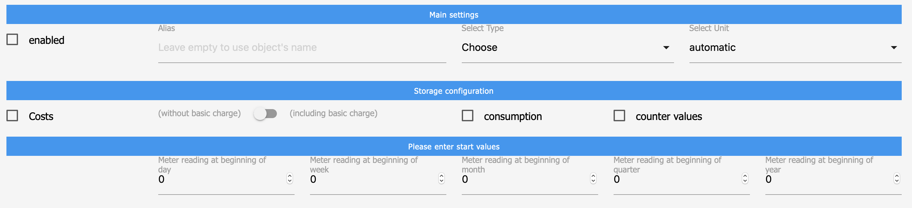
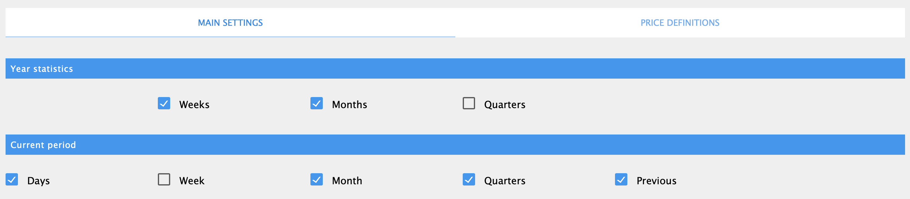
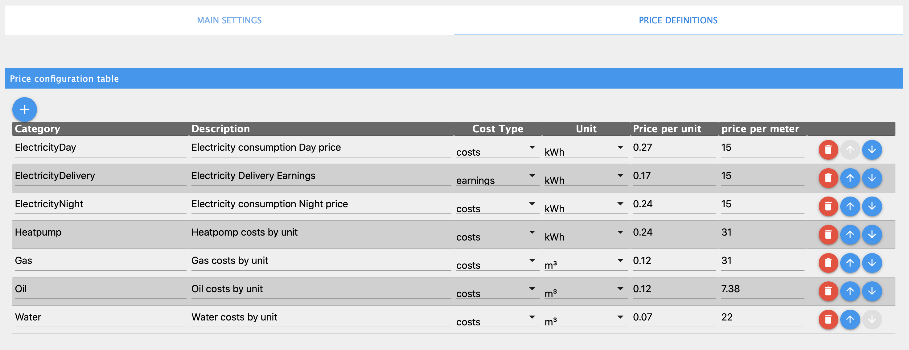
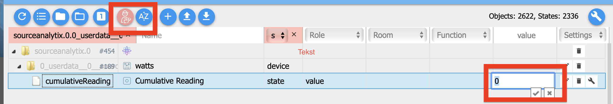
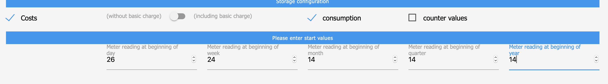

# SourceAnalytix

[](https://www.npmjs.com/package/iobroker.sourceanalytix)
[](https://www.npmjs.com/package/iobroker.sourceanalytix)


[](https://david-dm.org/DrozmotiX/iobroker.sourceanalytix)
[](https://weblate.iobroker.net/engage/adapters/?utm_source=widget)
[](https://nodei.co/npm/iobroker.sourceanalytix/)  
   

**This adapter uses the service [Sentry.io](https://sentry.io) to automatically report exceptions and code errors and new device schemas to me as the developer.** More details see below!

Detailed analysis of your Energy, gas and liquid consumptions
Any source (kWh, Wh, Watt, l/h or m3) can be used for data analyses:

## Features

#### Basic features
| state | functionality | Description |
|--|--|--|
| >device<.cumulativeReading |  [accumulate values](#cumulativereading) | Calculate cumulated values <br/> including [transformation](#valuetransformation) <br/>cumulated value can be change by following [these steps](#cumulativereading-reset) |
| >Device<.>Year<.>Year statistics< | [Yearly statistics](#year-statistics) | Store statistic information of the Year at level <br/> >device.>thisYear<.>selected period< |
| >Device<.>Year<.>currentYear | [Current Year statistics](#current-period)  | Store statistic information of the current Year at level <br/> >device.>currentYear<.>selected period< |
| >Year<.>currentYear.>Consumption type < | [Consumption](#consumptioncalculation) | Root folder to store consumption data <br/> (current value - previous value). <br/> Can be consumption or delivery |
| >Year<.>currentYear.>Cost type < | [Costs](#costcalculation) | Root folder to store cost data. <br/> current value * cost + basic price <br/> Can be consumption or delivery |

All state locations are grouped by state name and separated in period and [Category](#categories) structures. <br/> 
Calculations will be automatically handled and values transformed to the proper unit  as defined in [Price-Definitions](#price-definitionsprice-definitions).

If you have any issues, please read the **[Troubleshooting](#troubleshooting)** first!

## How-To

### State-Activation 




| Configuration Item | Description |
|--|--|
| enabled | Activate state for SourceAnalytix | 
| Alias | default: name of state, Name of device as shown in SA|
| Select Type | mandatory, choose you calculation type to calculate according [Price-Definitions](#price-definitions) |
| Select Unit | default: automatically, choose manually if needed (see logs) |
| Costs       | Cost calculation |
| with(out) basic charge  | incl;ude basic charge in cost calculation |
| consumption | calculate consumption data |
| counter values | store current counter values |
| Meter reading at <br/> 
  beginning of x : | Start value of counter for specific period to handle <br/> calculation current - startValue|

### Basic configuration (adapter instance)


#### cumulativeReading
*ToDo : Describe logic*

#### consumptionCalculation
*ToDo : Describe logic*

#### costCalculation
*ToDo : Describe logic*
 
#### valueTransformation
*ToDo : Document link to library (document lib also !)*<br/>
*ToDo : Document watt to kWh transformation*<br/>
*ToDo : Document unit transformation (like Watt, to Wh to KWh)*

#### Year-Statistics
Store statistic information of consumption/prices and/or costs/earnings at the Year level <br/> 
> >device.>thisYear<.>category<.>selected period

This information is typically used for data storage and historical comparisons. <br/>
States are grouped by specified period
(like year 2020 vs 2021, ore february 2019 vs february ect)

>#### *Weeks* <br/>
  >Device<.>Year<.>costs/earnings <br/> 
> consumption/delivery<.weeks.**weekNr**<
>#### *Months* <br/>
  >Device<.>Year<.>costs/earnings <br/> 
> consumption/delivery<.months.**Month**<
>#### *Quarters* <br/>
  >Device<.>Year<.>costs/earnings <br/> 
> consumption/delivery<.quarters.**Qx**<

#### Current-Period
Store statistic information of the current Year at level :
>device.>currentYear<.>selected period

>#### *Weeks* <br/>
  >Device<.>Year<.>costs/earnings <br/> 
> consumption/delivery<.weeks.**weekNr**<
>#### *Months* <br/>
  >Device<.>Year<.>costs/earnings <br/> 
> consumption/delivery<.months.**Month**<
>#### *Quarters* <br/>
  >Device<.>Year<.>costs/earnings 
  > consumption/delivery<.quarters.**Qx**<

This information is typically used for daily/weekly/monthly calculation of <br/> 
costs/earnings and/or consumption/delivery grouped by specified period

>ToDo : Add screenshots<

#### Categories
| category | type | Description |
|--|--|--|
| costs | financial | Result of calculation value * cost price + basic price |
| earnings | financial | Result of calculation value * earning price + basic price |
| consumption | calculations | Result of calculation value as cost - start value <br/>  of Year/Month/Quarter  etc |
| delivery | calculations | Result of calculation value as delivery - start value <br/>  of Year/Month/Quarter  etc |

### Troubleshooting

Before we start troubleshooting, it's important to understand how source analytix initialises as here errors may occur, see issue section.
The following sequence will be handled :

1) Start SourceAnalytix
2) List all states activated for SourceAnalytix
3) Initiate states, for each state :
    * Read current cumulatedReading <br/>
      (if present) and memory values from state
    * Check if unit can be handled {Issue 1}
    * Check if cost type is chosen {Issue 2}
    * Verify if valid price definition is present for cost type {Issue 3}
    * Check if previous init value > current cumulated value {Issue 4}
    * Check if valid known of previous device reset > current cumulated value {Issue 5}
    * Store all data to memory
4) Initialise states for each state :
    * create state cumulativeReading (to store results  of calculation, can also be used for W to kWh only) {Issue 6}
    * create states as chosen in state configuration {Issue 7}
    * start calculation
5) On state change/update
    * Verify if information is correct 
    * transform value to proper unit (unit of state to unit chosen in state configuration)
    * check if value input is correct ( current value **>** previousInit value) {See **7 At device reset** Issue 8}
    * calculate {Issue 9}
      * For Watt : calculate Watt to kWh ,calculate cumulatedReading = currentReading + cumulatedReading
      * For other : calculate cumulatedReading = currentReading + previousDeviceReset (if present)
6) At night (00.00)
    * List all SourceAnalytix enabled states
    * Reset start (Day/Week/Year/Month) values
7) At device reset
    * Store current value as previousDeviceReset and previousInit value <br/>
      If the device wil be reset again (detected by previousInit value),<br/> 
      currentReading + previousDeviceReset is stored as to previousDeviceReset.

**Issue 1** No unit defined for ....., cannot execute calculations<br/>
    Please select correct unit in state settings

**Issue 2** No cost type defined for ....., please Select Type of calculation at state setting<br/>
    Please selected wanted cost-type for to understand what amount should be used to handle calculations

**Issue 3** Selected Type ... does not exist in Price Definitions<br/>
    Now Price definitions are found for the chosen cost type, please verify your price setting (adapte config)

**Issue 4** Check settings for ..... ! Known init value : ..... > known cumulative value ..... cannot proceed<br/>
    The known init value > known cumulated values, this can be solved by removing or modifying these objects in the state raw object
    ```"valueAtDeviceInit": xxxx```

**Issue 5** Check settings for ..... ! Known valueAtDeviceReset : ..... > known cumulative value ..... cannot procee<br/>
    The known init value > known cumulated values, this can be solved<br/>
removing or modifying these objects in the state raw object
    ```valueAtDeviceReset": xxxx```

**Issue 6** State for cumulativeReading is not created<br/>
    Initialisation of state did fail, see issue 1 to 5

**Issue 7** States for costs readings ae not created<br/>
    Type of calculation is not enabled in state settings


### Price-Definitions


**Issue 8** current value **<** previousInit<br/>
A device reset is detected, see function 7

**Issue 9** My calculations are incorrect<br/>
#### cumulativeReading-Reset
  1) Verify if the correct unit is chosen (of not selected, SA will  try to autodetect)
  2) Verify if the cumulatedReading reflects the correct total value of your value reading, if not<br/>
        - Stop SA
        - Go to tab objects
          
        - Enter expert mode
        - Change the cumulatedReading
        - Exit expert mode
        - Ensure the start values are set correctly
        - Start SA <br/>
          
  3) Ensure the start values are set correctly<br/>
        SA handles calculations by cumulatedReading - known cumulatedReading at period start.<b/>
        These start values are defined at the state settings and should be < than **currentReading**<br/>
        Please ensure cumulativeReading >= DayStart >= WeekStart >= MonthStart >= QuarterStart >= YearStart
     
     
4) Verify these values in state raw object :
   ```valueAtDeviceReset": xxx```
   ```"valueAtDeviceInit": xxx```

<!--
**Issue 6** Setting - Cannot deactivate state for SourceAnalytix

Im RAW NUR "consumption":false umgestellt, gespeichert. Das wurde behalten (wo ggf. noch nicht false, auch bei "enabled": false und bei "costs": false )
In der Objekt-Übersicht ist der Schraubenschlüssel nachwievor blau. Dann mit dem Schraubenschlüssel in das Objekt, SA war nicht der Haken bei aktiviert drin. Dort einmal auf aktiviert, nicht speichern, wieder auf deaktiviert, speichern.
Kontrolle im RAW, ob SA-EIntrag nun weg => jup, is nun fott
-->

<!--
* Trace consumption daily, weekly, monthly, quarterly, yearly
* calculate costs (current price is configurable)
* Can be used for Power Consumption, liquids, and GAS
* Input values can be wh/kWh/Watt/m3/l
-->

This adapter has is roots with thanks to pix back in 2016 
https://forum.iobroker.net/viewtopic.php?f=21&t=2262

Which has been improved by `@hadering` and published on github
https://github.com/hdering/homematic_verbrauchszaehler

## To-Do
* [ ] Documentation!
* [ ] Period calculation selectable but not yet implemented
* [ ] monthly cost price not yet implemented in calculation
* [ ] recalculation based on meter values (configurable by date)
* [ ] add object states for previous [x]day, [x]week, [x]month, [x]quarter, [x]year configurable in adapter settings

## Support me
If you like my work, please consider a personal donation  
(this is a personal Donate link for DutchmanNL, no relation to the ioBroker Project !)  
[](http://paypal.me/DutchmanNL)

## What is Sentry.io and what is reported to the servers of that company?
Sentry.io is a service for developers to get an overview about errors from their applications. And exactly this is implemented in this adapter.

When the adapter crashes or any other Code error happens, this error message that also appears in the ioBroker log is submitted to Sentry. When you allowed iobroker GmbH to collect diagnostic data then also your installation ID (this is just a unique ID **without** any additional infos about you, email, name or such) is included. This allows Sentry to group errors and show how many unique users are affected by such an error. All of this helps me to provide error free adapters that basically never crashs.

<!--
    Placeholder for the next version (at the beginning of the line):
    ### __WORK IN PROGRESS__
-->
## Changelog
### 0.4.14 (2022-02-23) Optimize Device reset handling
* (DutchmanNL) Small code updates, lifecycle patches
* (DutchmanNL) Option to disable device reset feature added
* (DutchmanNL) Bugfix: Cannot read property 'name' of undefined solved

### 0.4.12 (2021-11-15) - requires JS-Controller >= 3.2!
* (DutchmanNL) Add logging to analyse error caught by sentry
* (DutchmanNL) "Cannot set property 'date' of undefined" solved
* (DutchmanNL) Major : New version requires JS-Controller >= 3.2!
* (DutchmanNL) Add possibility to use an alternative name (alias)
* (DutchmanNL) Avoid writing source state causing incorrect calculations at day reset #470

### 0.4.11 (2021-08-16)
* (DutchmanNL) Improve log/error messages at adapter start
* (DutchmanNL) Bugfix : Cannot read property 'calcValues' of null & related issues found by Sentry

### 0.4.10 (2021-08-10)
* (DutchmanNL) Bugfix : Avoid adapter crash during night for incorrect configured states [#460](https://github.com/DrozmotiX/ioBroker.sourceanalytix/issues/460)

### 0.4.9 (2021-05-31)
* (DutchmanNL) Added support for Admin 5 (Requires Admin >= 5.1.2)
* (Bluefox) Fix error in admin

## License
MIT License

Copyright (c) 2022 DrozmotiX Services B.V.

Permission is hereby granted, free of charge, to any person obtaining a copy
of this software and associated documentation files (the "Software"), to deal
in the Software without restriction, including without limitation the rights
to use, copy, modify, merge, publish, distribute, sublicense, and/or sell
copies of the Software, and to permit persons to whom the Software is
furnished to do so, subject to the following conditions:

The above copyright notice and this permission notice shall be included in all
copies or substantial portions of the Software.

THE SOFTWARE IS PROVIDED "AS IS", WITHOUT WARRANTY OF ANY KIND, EXPRESS OR
IMPLIED, INCLUDING BUT NOT LIMITED TO THE WARRANTIES OF MERCHANTABILITY,
FITNESS FOR A PARTICULAR PURPOSE AND NONINFRINGEMENT. IN NO EVENT SHALL THE
AUTHORS OR COPYRIGHT HOLDERS BE LIABLE FOR ANY CLAIM, DAMAGES OR OTHER
LIABILITY, WHETHER IN AN ACTION OF CONTRACT, TORT OR OTHERWISE, ARISING FROM,
OUT OF OR IN CONNECTION WITH THE SOFTWARE OR THE USE OR OTHER DEALINGS IN THE
SOFTWARE.
