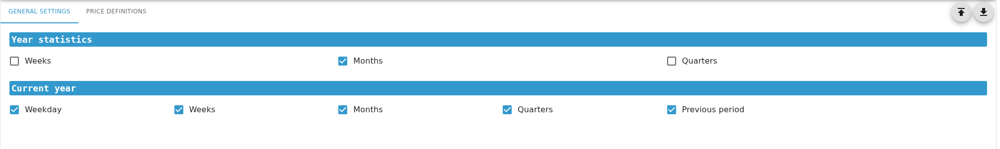
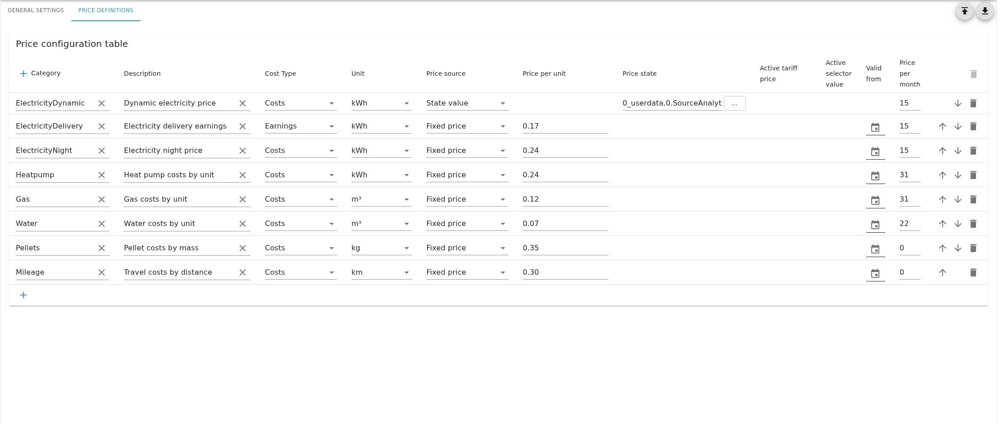
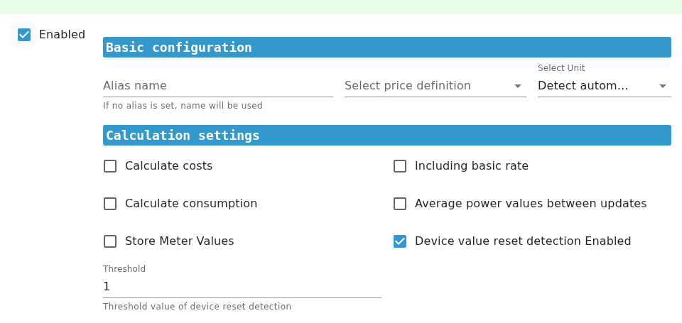
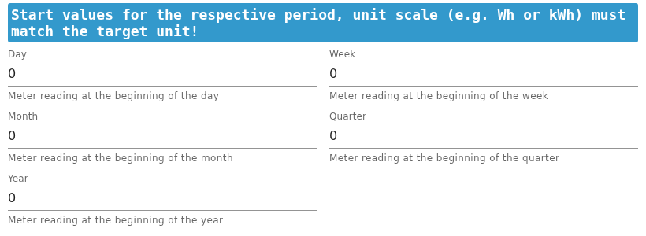
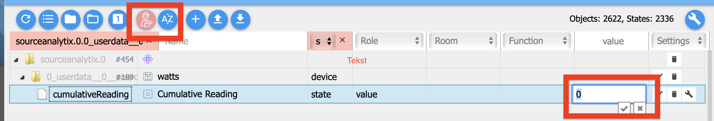

# SourceAnalytix

[](https://www.npmjs.com/package/iobroker.sourceanalytix)
[](https://www.npmjs.com/package/iobroker.sourceanalytix)
[](https://iobroker.live)
[](https://iobroker.live)
[](https://weblate.iobroker.net/engage/adapters/?utm_source=widget)
[](https://github.com/DrozmotiX/ioBroker.sourceanalytix/actions/workflows/test-and-release.yml)

SourceAnalytix turns cumulative meter readings or regularly updated power values into consumption, delivery, cost and earnings statistics. It supports fixed prices, scheduled price changes, dynamic tariffs from ioBroker states and selector-controlled tariffs.

The adapter requires **Admin 7.6.20 or newer**, **js-controller 6.0.11 or newer** and **Node.js 22 or newer**.

## What is Sentry.io and what is reported to the servers of that company?

This adapter uses Sentry libraries to automatically report exceptions and code errors to the developers. For more details and for information how to disable the error reporting see [Sentry-Plugin Documentation](https://github.com/ioBroker/plugin-sentry#plugin-sentry)! Sentry reporting is used starting with js-controller 3.0.

When the adapter crashes or another code error occurs, the error message which also appears in the ioBroker log is submitted to Sentry. If you allowed ioBroker GmbH to collect diagnostic data, your installation ID is included. This is an anonymous identifier without personal information such as your name or email address. It allows errors to be grouped and shows how many installations are affected.

## Features

- Current day, week, month, quarter and year totals
- Optional previous-period values and current-year weekday, week, month and quarter collections
- Optional archived week, month and quarter statistics below each calendar year
- Consumption and delivery calculations
- Cost and earnings calculations with an optional monthly basic price
- Fixed, scheduled, state-provided and selector-controlled unit prices
- Timestamped price history which preserves already calculated costs
- Automatic conversion between compatible energy, volume, mass and metric length units
- Integration of power readings over their actual update intervals, optionally ignoring negative readings
- Recovery of missed calendar rollovers after a restart, on request or by an hourly check
- Handling of meter resets, meter replacements and small backwards fluctuations
- One compact, automatically updated statistics JSON state per active source

## Setup

### 1. Configure the adapter instance

The **General settings** tab controls which detailed statistics are created. Disabling an option removes the corresponding optional states while retaining the normal current-period totals and existing archived years.



| Setting | Result |
| --- | --- |
| Year statistics: Weeks / Months / Quarters | Stores completed values below `<source>.<year>` for historical comparison. |
| Current year: Weekday | Stores the current week's values by weekday. |
| Current year: Weeks / Months / Quarters | Stores values for each period below `<source>.currentYear`. |
| Current year: Previous period | Stores the completed day, week, month, quarter and year, plus the previous week's weekday values. |
| Rounding: Decimals for consumption values | Decimals for calculated quantities and meter readings, `3` by default. |
| Rounding: Decimals for cost values | Decimals for calculated costs and earnings, `2` by default. |

Both rounding settings accept `-1` to store the exact calculated value without rounding. A single source can deviate from them: its **Decimals for consumption values** and **Decimals for cost values** fields override the global setting and use it whenever they are left empty. Rounding only affects the values written to states; internal calculations, the cumulative reading and the persisted memories always keep full precision, so no accuracy is lost over time.

SourceAnalytix remembers the last successfully processed calendar periods. If the adapter or ioBroker is not running at midnight, missed day, week, month, quarter and year changes are processed once at the next start.

A rollover can also be triggered without restarting the instance, which is useful when the instance is noticed to be down shortly after midnight:

- Set `sourceanalytix.<instance>.info.recoverPeriods` to `true`. The button resets itself when the run is finished.
- Or send a message from a script: `sendTo('sourceanalytix.<instance>', 'recoverPeriods', {}, result => log(result.recovered))`. The reply contains the number of sources whose rollover was processed.

An hourly check performs the same recovery on its own, so a rollover missed while the adapter kept running - after a host suspend or a system time correction - is corrected automatically. Every route is idempotent: sources whose periods are already up to date are skipped.

### 2. Create price definitions

Open **Price definitions** and add the categories that source states should use.



| Field | Description |
| --- | --- |
| Category | Unique identifier shown in the source state's **Select price definition** field. |
| Description | Free-text description of the tariff. |
| Cost type | Selects the `costs`/`consumed` or `earnings`/`delivered` result categories. |
| Unit | Target unit for consumption and the denominator of the unit price. |
| Price source | Fixed price, numeric ioBroker state or tariff selector. |
| Price per unit | Unit price for a fixed tariff, or the inactive/base price for a selector. |
| Price state | Full ID of the numeric price state or tariff selector state. |
| Active tariff price | Price used while a selector is active. |
| Active selector value | Optional exact value which activates the alternate tariff. |
| Valid from | Optional date from which the tariff, including its monthly basic price, applies. |
| Price per month | Monthly basic price, applied only to sources with **Including basic rate** enabled. |

#### Fixed and scheduled prices

Select **Fixed price** and enter **Price per unit**. When changing a tariff, set **Valid from** to the date on which the new price becomes effective. The previous price remains in the history and is not applied retroactively.

#### Dynamic price state

Select **State value** and choose the state containing the current numeric unit price. SourceAnalytix subscribes to that state and records every change with the state's timestamp. Both numbers and numeric strings with a dot or comma decimal separator are accepted.

The state value must represent the system currency per selected target unit, for example currency/kWh when the price definition uses `kWh`. Convert values such as cents per kWh in the source adapter or a script before using them.

#### Tariff selector

Select **Tariff selector** for day/night, relay, contact or other two-price tariffs:

- **Price per unit** is the inactive/base price.
- **Active tariff price** is used while the selector is active.
- Without **Active selector value**, `true`, non-zero numbers and common truthy strings activate the alternate tariff.
- With **Active selector value**, only an exact string representation match activates the alternate tariff.

#### Writable current price

Each category exposes `sourceanalytix.<instance>.priceDefinitions.<category>.currentPrice`. Scripts and visualizations can write a numeric value to this state to apply a new price immediately. The value is also appended to the timestamped price history.

#### Historical price calculation

Prices are time-dependent. A new price only applies from its change timestamp onward and never changes costs already accumulated for earlier consumption.

For a cumulative meter, SourceAnalytix knows the consumption delta between two readings. If one or more price changes occurred inside that interval, the delta is distributed proportionally across the elapsed time segments and each share is charged at the price valid for that segment. A price change exactly at the timestamp of the later meter reading applies to the following interval.

The precise cost accumulator and price history survive adapter restarts. Explicit recalculation of old historical data is not currently implemented.

#### Monthly basic price

Enable **Including basic rate** on a source to add the configured monthly price. **Valid from** also defines the first month for this charge. The full basic price is booked once when the tariff first becomes valid and then at the beginning of every following calendar month. A price change during a month applies to the next monthly booking, while previous months remain unchanged. Existing tariffs without a validity date retain the previous behavior by starting at the beginning of the current calendar year.

Day and week totals include the full monthly charge only when its booking date falls into that period. Month, quarter and year totals contain the full charges booked in their respective calendar periods.

### 3. Activate a source state

SourceAnalytix is configured through the ioBroker custom settings of each source state. Open **Objects**, click the wrench/configuration icon of the desired state and expand the SourceAnalytix instance.




| Setting | Description |
| --- | --- |
| Enabled | Activates this source for the selected SourceAnalytix instance. |
| Alias | Optional display name for the generated device. It does not change the generated state ID. |
| Select price definition | Mandatory category from the adapter's price definitions. |
| Select Unit | Source unit. Leave on automatic detection when the source object has a correct supported unit. |
| Calculate costs | Creates and updates cost or earnings states. |
| Including basic rate | Adds the price definition's monthly basic price. |
| Calculate consumption | Creates and updates consumption or delivery states. |
| Average power values between updates | Optional calculation mode for power states; see [Power states](#power-states). |
| Ignore negative power values | Counts negative power readings as `0 W`; see [Power states](#power-states). |
| Store Meter Values | Stores meter readings in the enabled period collections. |
| Device value reset detection | Continues a cumulative total after a meter reset or replacement. |
| Threshold | Largest backwards fluctuation ignored as measurement jitter, expressed in the target unit. |

The source state ID is converted to the generated SourceAnalytix device ID by replacing dots with double underscores.

## Source Values And Units

### Cumulative source states

Use a cumulative total which normally only increases, for example Tasmota `ENERGY_Total` or a smart meter's total consumption. Do not use a value such as `ENERGY_Today` that intentionally resets every day. If no cumulative total is available, create one in an upstream adapter or script.

For cumulative sources, consumption is calculated as:

```text
current cumulative reading - reading at the beginning of the period
```

On first activation, SourceAnalytix initializes empty or zero day, week, month, quarter and year start values with the current normalized meter reading. This prevents the existing lifetime meter total from appearing as new consumption. The values remain editable and are not overwritten on later starts.



Enter manual start values in the **target unit** selected by the price definition. Each value must represent the meter reading at the beginning of that period, not the consumption during the period.

### Power states

Power values such as `W` or `kW` are integrated over the actual time between state updates to produce energy. The first reading establishes the baseline and does not create consumption.

By default, the previous power value is treated as valid for the complete interval. Enable **Average power values between updates** for sensors which report regularly and change gradually; SourceAnalytix then uses the average of the previous and current values. Leave it disabled for devices that switch abruptly when the update marks the switch event.

Some inverters report a strongly negative power while they are switched off, which would otherwise be integrated as negative energy and reduce the accumulated yield. Enable **Ignore negative power values** to count such readings as `0 W`. The reading is clamped rather than discarded, so the interval still advances; discarding it would keep the last positive power as the baseline and integrate it across the whole downtime.

### Supported units

SourceAnalytix automatically converts values only between compatible quantities:

| Quantity | Supported units |
| --- | --- |
| Power | `GW`, `MW`, `kW`, `W`, `mW` |
| Energy | `GWh`, `MWh`, `kWh`, `Wh`, `mWh` |
| Cubic volume | `km³`, `m³`, `dm³`, `cm³`, `mm³` |
| Liquid volume | `hl`, `l`, `dl`, `cl`, `ml` |
| Mass | `t`, `kg`, `g` |
| Metric length | `km`, `m`, `dm`, `cm`, `mm`, `µm`, `nm` |

Liter and cubic-meter units can be converted into each other. Incompatible conversions, such as kilograms to kWh or meters to liters, are rejected instead of producing misleading results.

## Generated States

For every source, SourceAnalytix creates a `cumulativeReading` and the enabled result trees:

| Path | Content |
| --- | --- |
| `<source>.currentYear.consumed` | Current consumption totals for cost categories. |
| `<source>.currentYear.delivered` | Current delivery totals for earnings categories. |
| `<source>.currentYear.costs` | Current cost totals. |
| `<source>.currentYear.earnings` | Current earnings totals. |
| `<source>.currentYear.meterReadings` | Optional meter readings by enabled periods. |
| `<source>.<year>` | Optional archived week, month and quarter statistics. |
| `<source>.statisticsJson` | Compact current-year statistics for VIS, scripts and other adapters. |

The basic current and optional previous states use names such as `01_currentDay`, `02_currentWeek`, `03_currentMonth`, `04_currentQuarter`, `05_currentYear` and their `previous` equivalents.

Previous values are written with the timestamp of the period they belong to, `23:59:59` on its last day, instead of the moment the rollover happens. History adapters therefore log a completed day, week, month, quarter or year inside that period, which is what visualizations such as Flot expect.

### Statistics JSON

Every active source automatically exposes a read-only `statisticsJson` state with role `json`; no additional setting is required. It contains the same calculated values as the individual states and does not perform a separate calculation.

```json
{
  "schemaVersion": 1,
  "year": 2026,
  "source": {
    "id": "smartmeter.0.total",
    "name": "Electricity meter",
    "unit": "kWh"
  },
  "quantity": {
    "type": "consumed",
    "current": {
      "day": 4.21,
      "week": 28.65,
      "month": 114.32,
      "quarter": 301.77,
      "year": 894.15
    },
    "previous": null,
    "periods": {
      "weekdays": null,
      "previousWeekdays": null,
      "weeks": {},
      "months": {},
      "quarters": {}
    }
  },
  "financial": {
    "type": "costs",
    "currency": "EUR",
    "current": {
      "day": 1.24,
      "week": 8.47,
      "month": 34.19,
      "quarter": 89.51,
      "year": 261.42
    },
    "previous": null,
    "periods": {
      "weekdays": null,
      "previousWeekdays": null,
      "weeks": {},
      "months": {},
      "quarters": {}
    }
  },
  "meterReadings": null
}
```

`quantity` represents either `consumed` or `delivered` values. `financial` represents either `costs` or `earnings`. `meterReadings` is populated when meter-value storage is enabled. Disabled calculations and period collections are represented by `null`, so the schema remains predictable.

Weekdays use `1` for Monday through `7` for Sunday. Week and month keys are zero-padded, and quarter keys use `1` through `4`. Only current-year collections and the optional previous-period values are included, preventing the state from growing indefinitely. The ioBroker state timestamp indicates when the JSON was last changed.

The state is rebuilt from existing statistics when the adapter starts and its writes are bundled during normal calculations. If a source is disabled or deleted, the last JSON value is retained together with the other calculated history and is no longer updated.

## Meter Resets And Corrections

With reset detection enabled, a decrease larger than **Threshold** is treated as a real meter reset or replacement. SourceAnalytix stores an offset and continues its cumulative reading without losing earlier consumption. A smaller backwards change is treated as jitter and ignored. A threshold of `0` treats every decrease as a reset.

If reset detection is disabled, decreasing source readings are accepted and can reduce calculated totals. This mode is intended only for sources where that behavior is expected.

To correct an already wrong `cumulativeReading`:

1. Stop the SourceAnalytix instance.
2. Open **Objects** and enable expert mode.
3. Correct `<source>.cumulativeReading`.
4. Open the source state's SourceAnalytix custom settings and correct the affected period start values in the same target unit.
5. Start the adapter again and verify the current-period results.



Changing the current unit price does not recalculate historical costs. There is currently no user-triggered historical recalculation.

## Troubleshooting

### Source is not initialized

- Verify that the custom configuration is enabled for the correct SourceAnalytix instance.
- Select an existing price definition. A price definition is required even when only consumption is enabled.
- Ensure the source unit can be detected from the object or select it manually.
- Check that the source and target units represent compatible quantities.
- Review the adapter log for the exact rejected state or configuration value.

### Consumption starts with the complete lifetime meter reading

This normally indicates old or manually entered period start values. Set the day, week, month, quarter and year starts to the corresponding historical meter readings. For today's value, this is usually:

```text
current cumulative reading - consumption since the beginning of today
```

### Dynamic prices appear incorrect

- Verify that the price state uses currency per target unit, not cents unless the value was converted.
- Check the timestamp of the price state and the source meter readings.
- Remember that a meter delta spanning price changes is divided by elapsed time because no finer consumption profile is available.
- Inspect `priceDefinitions.<category>.currentPrice` for the active price.

## Known Limitations

- Automatic historical recalculation is intentionally disabled, and no explicit recalculation action is available yet.
- User-configurable rolling periods are not implemented.
- Unitless counters, time units and digital-size units are not supported.

## Credits

The adapter's roots go back to work by pix in 2016:
[ioBroker forum thread](https://forum.iobroker.net/viewtopic.php?f=21&t=2262)

It was later improved by `@hadering` and published as
[homematic_verbrauchszaehler](https://github.com/hdering/homematic_verbrauchszaehler).

## Support me
If you like my work, please consider a personal donation.

This is a personal donation link for DutchmanNL and is not related to the ioBroker project.

[](https://paypal.me/DutchmanNL)

<!--
    Placeholder for the next version (at the beginning of the line):
    ### __WORK IN PROGRESS__
-->
## Changelog
### __WORK IN PROGRESS__
* (DutchmanNL) Maintenance: raise Node.js to 22, modernise CI and release tooling, update dependencies, resolve repository checker findings

### 0.5.6 (2026-08-02)
* The monthly basic price is booked as a full charge when the tariff first becomes valid and at the beginning of every following calendar month, instead of being spread over the days of a month ([#1193](https://github.com/DrozmotiX/ioBroker.sourceanalytix/pull/1193)).
* **Valid from** now also defines the first month the monthly basic price is charged, while tariffs without a validity date keep starting at the beginning of the current calendar year ([#1193](https://github.com/DrozmotiX/ioBroker.sourceanalytix/pull/1193)).
* Monthly basic prices are recorded in their own `basicPriceHistory` state, so a price change during a month only applies to the next monthly booking and already booked months stay unchanged ([#1193](https://github.com/DrozmotiX/ioBroker.sourceanalytix/pull/1193)).
* **Valid from** is available for every price source, not only for fixed prices, and a selected date becomes effective at local midnight ([#1193](https://github.com/DrozmotiX/ioBroker.sourceanalytix/pull/1193)).

### 0.5.5 (2026-08-01)
* Previous day, week, month, quarter and year values are written with the timestamp of the period they belong to (23:59:59 on its last day), so history adapters and Flot plot them in the correct period ([#497](https://github.com/DrozmotiX/ioBroker.sourceanalytix/issues/497)).
* The number of decimals for consumption and cost values is configurable globally and per source, including an option to store the exact value without rounding ([#934](https://github.com/DrozmotiX/ioBroker.sourceanalytix/issues/934)).
* A missed calendar rollover can be processed without restarting the instance, through the new `info.recoverPeriods` button or a `recoverPeriods` message, and an hourly check recovers a rollover the scheduler missed while the adapter kept running ([#905](https://github.com/DrozmotiX/ioBroker.sourceanalytix/issues/905)).
* The midnight scheduler can no longer raise an unhandled rejection, and its cron job and timers are stopped when the instance shuts down ([#904](https://github.com/DrozmotiX/ioBroker.sourceanalytix/issues/904)).

### 0.5.4 (2026-08-01)
* Each active source automatically exposes a compact `statisticsJson` state containing its current-year quantity, financial and optional meter-reading statistics ([#361](https://github.com/DrozmotiX/ioBroker.sourceanalytix/issues/361), [#967](https://github.com/DrozmotiX/ioBroker.sourceanalytix/issues/967)).
* Monthly basic prices are no longer imported into the variable-cost accumulator and added a second time after a restart ([#1188](https://github.com/DrozmotiX/ioBroker.sourceanalytix/issues/1188)).

### 0.5.3 (2026-07-28)
* Power states can optionally ignore negative readings, so inverters which report a negative power while switched off no longer reduce the accumulated yield ([#466](https://github.com/DrozmotiX/ioBroker.sourceanalytix/issues/466)).

### 0.5.2 (2026-07-28)
* The npm release workflow no longer fails at the Sentry step: commit association is disabled because the previous release commit is not reachable in the shallow, squash-merged history ([#1179](https://github.com/DrozmotiX/ioBroker.sourceanalytix/issues/1179)).
* README now carries the standard Sentry notice required by the ioBroker repository checker ([#1179](https://github.com/DrozmotiX/ioBroker.sourceanalytix/issues/1179)).

[Older changelog entries](CHANGELOG_OLD.md)

[Older changelogs can be found there](CHANGELOG_OLD.md)

## License
MIT License

Copyright (c) 2022-2026 DrozmotiX Services B.V.

Permission is hereby granted, free of charge, to any person obtaining a copy
of this software and associated documentation files (the "Software"), to deal
in the Software without restriction, including without limitation the rights
to use, copy, modify, merge, publish, distribute, sublicense, and/or sell
copies of the Software, and to permit persons to whom the Software is
furnished to do so, subject to the following conditions:

The above copyright notice and this permission notice shall be included in all
copies or substantial portions of the Software.

THE SOFTWARE IS PROVIDED "AS IS", WITHOUT WARRANTY OF ANY KIND, EXPRESS OR
IMPLIED, INCLUDING BUT NOT LIMITED TO THE WARRANTIES OF MERCHANTABILITY,
FITNESS FOR A PARTICULAR PURPOSE AND NONINFRINGEMENT. IN NO EVENT SHALL THE
AUTHORS OR COPYRIGHT HOLDERS BE LIABLE FOR ANY CLAIM, DAMAGES OR OTHER
LIABILITY, WHETHER IN AN ACTION OF CONTRACT, TORT OR OTHERWISE, ARISING FROM,
OUT OF OR IN CONNECTION WITH THE SOFTWARE OR THE USE OR OTHER DEALINGS IN THE
SOFTWARE.
